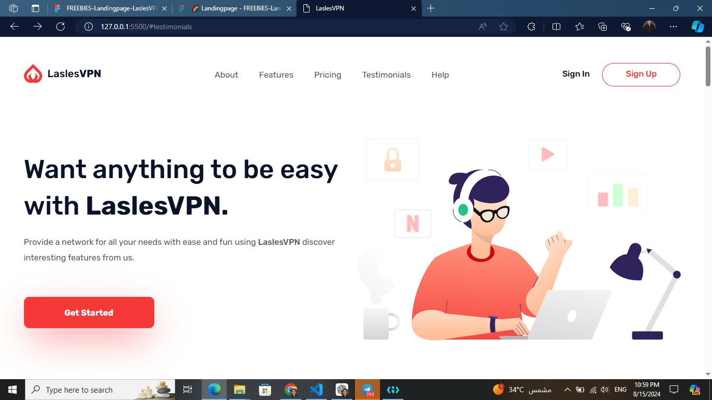

# 🌐 LaslesVPN-Landingpage
 
## 📝 Overview
LaslesVPN is a sophisticated web development project created using HTML5, CSS3, and Sass (SCSS). This project highlights modern web design practices, including responsive design, CSS animations, CSS Flexbox, and CSS Grid. It was developed as my graduation project from an intensive HTML and CSS course.

🎉 This project showcases my journey in web development and the skills I have acquired along the way. 

### Screenshot

## 🚀 Technologies Used
In this project, I have utilized the following technologies:
- **HTML**: For structuring the content of the website.
- **CSS**: For styling the website.
- **SASS**: For more efficient and organized CSS.
- **Responsive Design**: Ensuring the website looks great on all devices.
- **CSS Animations**: Adding interactive elements to enhance user experience.
- **CSS Grid**: For creating complex layouts easily.
- **CSS Flexbox**: For flexible and responsive layout structures.

## 🌍 Live Demo

You can view the live version of the project [LaslesVPN](https://saif-zerana.github.io/LaslesVPN-Landingpage/).
Your feedback will be highly appreciated! 😊

## Acknowledgments
- [ Mohamed Aabusrea](https://github.com/mohamedabusrea)  👨‍💻, for the amazing course.
- [@Ahmad Fathy](https://github.com/afkhalid)🌟, founder of almdrasa platform
-  [@Almdrasa](https://github.com/Almdrasa) platform

## Contact
Feel free to reach out if you have any questions or suggestions:
- **Email**: [MY-Email](mailto:saifzerana@gmail.com)
- **LinkedIn**: [Saif Abdelrhman Zerana](https://www.linkedin.com/in/saif-zerana/)

Thank you for visiting my project! 🚀
